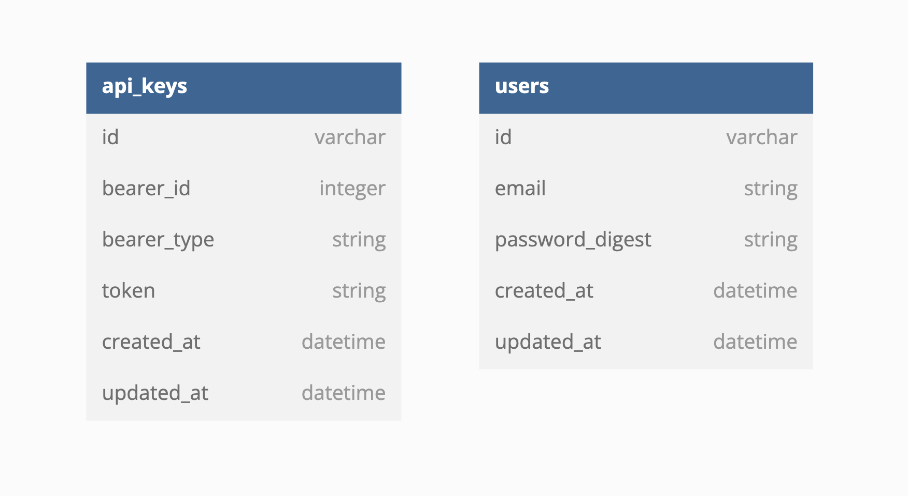

<div align="center">

## Sweater Weather Final

[![ruby][ruby]][ruby-url] [![ror][ror]][ror-url] [![Postgres][Postgres]][Postgres-url] [![RSpec][RSpec]][RSpec-url] [![Atom][Atom]][Atom-url]

#### Contributors: [Anna Marie Sterling](https://github.com/AMSterling)

</div>

---

## Description

A rails backend API; Sweater Weather Final was built with test-driven development, with RSpec used for testing. It is built with Rails conventions over configuration as a guiding principle. A service-facade design pattern is used when calling external API services.

---

# <a name="contents"></a> Table of contents

- [Architecture](#architecture)
- [Database setup](#database-setup)
  - [Required API keys](#required-keys)
- [Endpoints](#endpoints)
  - [Create User](#create-user)
  - [Weather Forecast by Location](#location-forecast)
  - [Fetch 5 Books by Location](#location-books)

---

# <a name="architecture"></a>Architecture

# 

---
<p align="right">(<a href="#contents">back to top</a>)</p>

# <a name="database-setup"></a>Database Setup

Instructions to set up a local version of Sweater Weather Final:

Fork and clone the project, then install the required gems with `bundle`. A full list of gems that will be installed can be found in the [gemfile][gemfile-url].

```sh
bundle install
```

Reset the database:

```sh
rake db:{drop,create,migrate}
```

## <a name="required-keys"></a> Required keys

Sweater Weather Final uses <a href="https://developer.mapquest.com/documentation/geocoding-api/" target="_blank" rel="noopener noreferrer">Mapquest Geocoding API</a>, <a href="https://openweathermap.org/api/one-call-api" target="_blank" rel="noopener noreferrer">OpenWeatherMap API</a>, and <a href="https://openlibrary.org/developers/api" target="_blank" rel="noopener noreferrer">OpenLibrary API</a>.

Once you have your key, set up your environment with

```sh
bundle exec figaro install
```

 Then add your keys to `config/application.yml`:

```ruby
map_api_key: <YOUR_MAPQUEST_KEY>
weather_api_key: <YOUR_OPENWEATHERMAP_KEY>
```

Start a rails server, and you're ready to query

```sh
rails s
```

---
<p align="right">(<a href="#contents">back to top</a>)</p>

# <a name="endpoints"></a>Endpoints

## <a name="create-user"></a>Create User

Creates a new user.

<br>

```
POST '/api/v1/users'
```

**Sample body**

 ```
 {
  "email": "alison.rempel@example.org",
  "password": "password",
  "password_confirmation": "password"
 }
 ```

**Sample response (status 200)**

 ```
 {
     "data": {
         "id": "238",
         "type": "users",
         "attributes": {
             "email": "alison.rempel@example.org",
             "api_key": "0ad3c1b8f30bb80fa0006a09ed2e62a3"
         }
     }
 }
 ```

---
<p align="right">(<a href="#contents">back to top</a>)</p>

## <a name="location-forecast"></a>Weather Forecast by Location

Retrieve weather for location.

<br>

```
GET "/api/v1/forecast?location=#{location}"
```

<br>

**Sample body**

 ```
 {
    "location": "lincoln,ne"
 }
 ```

**Sample response (status 200)**

 ```
 {
     "data": {
         "id": "1",
         "type": "forecast",
         "attributes": {
             "current_weather": {
               "datetime":"2023-01-11 15:08:20 -0700",
               "sunrise":"2023-01-11 06:50:19 -0700",
               "sunset":"2023-01-11 16:18:37 -0700",
               "temperature":38.44,
               "feels_like":29.5,
               "humidity":75,
               "uvi":0.19,
               "visibility":10000,
               "conditions":"clear sky",
               "icon":"01d"
             },
             "daily_weather": [{
               "date":"2023-01-11",
               "sunrise:""2023-01-11 06:50:19",
               "sunset":"2023-01-11 16:18:37",
               "max_temp":41.11,
               "min_temp":31.15,
               "conditions":"broken clouds",
               "icon":"04d"
              },
              {
                "date":"2023-01-12",
                "sunrise":"2023-01-12 06:50:03",
                "sunset":"2023-01-12 16:19:41",
                "max_temp":32.88,
                "min_temp":22.23,
                "conditions":"clear sky",
                "icon":"01d"},
              {
                "date":"2023-01-13",
                "sunrise":"2023-01-13 06:49:44",
                "sunset":"2023-01-13 16:20:46",
                "max_temp":36.52,
                "min_temp":18.21,
                "conditions":"clear sky",
                icon":"01d"
              },
              {
                "date":"2023-01-14",
                "sunrise":"2023-01-14 06:49:22",
                "sunset":"2023-01-14 16:21:51",
                "max_temp":47.44,
                "min_temp":28.45,
                "conditions":"overcast clouds",
                "icon":"04d"
              },
              {
                "date":"2023-01-15",
                "sunrise":"2023-01-15 06:48:59",
                "sunset":"2023-01-15 16:22:58",
                "max_temp":53.19,
                "min_temp":37.85,
                "conditions":"broken clouds",
                "icon":"04d"
              }],
             "hourly_weather":[{
                "time":"15:00",
                "temperature":38.44,
                "conditions":"clear sky",
                "icon":"01d"
              },
              {
                "time":"16:00",
                "temperature":38.52,
                "conditions":"few clouds",
                "icon":"02d"
              },
              {
                "time":"17:00",
                "temperature":37.62, "conditions":"scattered clouds", "icon":"03n"
              },
              {
                "time":"18:00",
                "temperature":36.27,
                "conditions":"broken clouds",
                "icon":"04n"
              },
              {
                "time":"19:00",
                "temperature":34.83,
                "conditions":"broken clouds",
                "icon":"04n"
              },
              {
                "time":"20:00",
                "temperature":33.24,
                "conditions":"overcast clouds", "icon":"04n"
              },
              {
                "time":"21:00",
                "temperature":32.32,
                "conditions":"overcast clouds",
                "icon":"04n"
              },
              {
                "time":"22:00",
                "temperature":31.15,
                "conditions":"overcast clouds",
                "icon":"04n"
              }]
          }
      }
  }
 ```

---
<p align="right">(<a href="#contents">back to top</a>)</p>

## <a name="location-books"></a>Fetch 5 Books by Location

Retrieve top 5 books about searched location.

<br>

```
GET '/api/v1/book-search?location=denver,co&quantity=5'
```

<br>

**Sample response (status 200)**

 ```
 {
   "data": {
     "id":nil,
     "type":"books",
     "attributes":{
       "destination":"denver,co",
       "forecast":{
         "summary":"broken clouds",
         "temperature":"54.27 F"
        },
      "total_books_found":39,
      "books":[
       {
         "isbn":["0762507845","9780762507849"],
         "title":"Denver, Co",
         "publisher":["Universal Map Enterprises"]
       },
       {
         "isbn":["9780607620054", "0607620056"],
         "title":"Denver west, CO and Bailey, CO: Denver, CO",
         "publisher":["USGS Branch of Distribution"]
       },
       {
         "isbn":["9780607620047", "0607620048"],
         "title":"Denver East, CO and Castle Rock, CO: Denver, CO",
         "publisher":["USGS Branch of Distribution"]
       },
       {
         "isbn":["0762557362", "9780762557363"],
         "title":"Denver Co Deluxe Flip Map",
         "publisher":["Universal Map Enterprises"]
       },
       {
         "isbn":["9781427401687", "1427401683"],
         "title":"University of Denver Co 2007",
         "publisher":["College Prowler"]
       }
      ]
     }
   }
 }
 ```

---
<p align="right">(<a href="#contents">back to top</a>)</p>

<!-- MARKDOWN LINKS & IMAGES -->
<!-- https://www.markdownguide.org/basic-syntax/#reference-style-links -->

[contributors-shield]: https://img.shields.io/github/contributors/AMSterling/sweater-weather.svg?style=for-the-badge
[contributors-url]: https://github.com/AMSterling/sweater-weather/graphs/contributors
[forks-shield]: https://img.shields.io/github/forks/AMSterling/sweater-weather.svg?style=for-the-badge
[forks-url]: https://github.com/AMSterling/sweater-weather/network/members
[gemfile-url]: https://github.com/AMSterling/sweater-weather/blob/final/Gemfile
[stars-shield]: https://img.shields.io/github/stars/AMSterling/sweater-weather.svg?style=for-the-badge
[stars-url]: https://github.com/AMSterling/sweater-weather/stargazers
[issues-shield]: https://img.shields.io/github/issues/AMSterling/sweater-weather.svg?style=for-the-badge
[issues-url]: https://github.com/AMSterling/sweater-weather/issues
[license-shield]: https://img.shields.io/github/license/AMSterling/sweater-weather.svg?style=for-the-badge
[license-url]: https://github.com/AMSterling/sweater-weather/blob/master/LICENSE.txt
[linkedin-shield]: https://img.shields.io/badge/-LinkedIn-black.svg?style=for-the-badge&logo=linkedin&colorB=555
[linkedin-url]: https://linkedin.com/in/sterling-316a6223a/

[Atom]: https://img.shields.io/badge/Atom-66595C?style=for-the-badge&logo=Atom&logoColor=white
[Atom-url]: https://github.com/atom/atom/releases/tag/v1.60.0

[Bootstrap]: https://img.shields.io/badge/bootstrap-%23563D7C.svg?style=for-the-badge&logo=bootstrap&logoColor=white
[Bootstrap-url]: https://getbootstrap.com/

[Capybara]: https://custom-icon-badges.demolab.com/badge/Capybara-F7F4EF?style=for-the-badge&logo=capybara
[Capybara-url]: https://www.patreon.com/capybara

[CircleCI]: https://img.shields.io/badge/circle%20ci-%23161616.svg?style=for-the-badge&logo=circleci&logoColor=white
[CircleCI-url]: https://circleci.com/developer

[CSS]: https://img.shields.io/badge/CSS-239120?&style=for-the-badge&logo=css3&logoColor=white
[CSS-url]: https://en.wikipedia.org/wiki/CSS

[Fly]: https://custom-icon-badges.demolab.com/badge/Fly-DCDCDC?style=for-the-badge&logo=fly-io
[Fly-url]: https://fly.io/

[Git Badge]: https://img.shields.io/badge/GIT-E44C30?style=for-the-badge&logo=git&logoColor=white
[Git-url]: https://git-scm.com/

[GitHub Badge]: https://img.shields.io/badge/GitHub-100000?style=for-the-badge&logo=github&logoColor=white
[GitHub-url]: https://github.com/<Username>/

[GitHub Actions]: https://img.shields.io/badge/github%20actions-%232671E5.svg?style=for-the-badge&logo=githubactions&logoColor=white
[GitHub Actions-url]: https://github.com/features/actions

[GraphQL]: https://img.shields.io/badge/-GraphQL-E10098?style=for-the-badge&logo=graphql&logoColor=white
[GraphQL-url]: https://graphql.org/

[Heroku]: https://img.shields.io/badge/Heroku-430098?style=for-the-badge&logo=heroku&logoColor=white
[Heroku-url]: https://www.heroku.com/

[Homebrew]: https://custom-icon-badges.demolab.com/badge/Homebrew-2e2a24?style=for-the-badge&logo=homebrew_logo
[Homebrew-url]: https://brew.sh/

[HTML5]: https://img.shields.io/badge/html5-%23E34F26.svg?style=for-the-badge&logo=html5&logoColor=white
[HTML5-url]: https://en.wikipedia.org/wiki/HTML5

[JavaScript]: https://img.shields.io/badge/javascript-%23323330.svg?style=for-the-badge&logo=javascript&logoColor=%23F7DF1E
[JavaScript-url]: https://www.javascript.com/

[jQuery]: https://img.shields.io/badge/jquery-%230769AD.svg?style=for-the-badge&logo=jquery&logoColor=white
[jQuery-url]: https://github.com/rails/jquery-rails

[LinkedIn Badge]: https://img.shields.io/badge/LinkedIn-0077B5?style=for-the-badge&logo=linkedin&logoColor=white
[LinkedIn-url]: https://www.linkedin.com/in/<Username>/

[MacOS]: https://img.shields.io/badge/mac%20os-000000?style=for-the-badge&logo=macos&logoColor=F0F0F0
[MacOS-url]: https://www.apple.com/macos

[Miro]: https://img.shields.io/badge/Miro-050038?style=for-the-badge&logo=Miro&logoColor=white
[Miro-url]: https://miro.com/

[Postgres]: https://img.shields.io/badge/postgres-%23316192.svg?style=for-the-badge&logo=postgresql&logoColor=white
[Postgres-url]: https://www.postgresql.org/

[PostgreSQL]: https://img.shields.io/badge/PostgreSQL-316192?style=for-the-badge&logo=postgresql&logoColor=white
[PostgreSQL-url]: https://www.postgresql.org/

[Postman]: https://img.shields.io/badge/Postman-FF6C37?style=for-the-badge&logo=postman&logoColor=white
[Postman-url]: https://web.postman.co/

[Rails]: https://img.shields.io/badge/rails-%23CC0000.svg?style=for-the-badge&logo=ruby-on-rails&logoColor=white
[Rails-url]: https://rubyonrails.org/

[Redis]: https://img.shields.io/badge/redis-%23DD0031.svg?&style=for-the-badge&logo=redis&logoColor=white
[Redis-url]: https://redis.io/

[Replit]: https://img.shields.io/badge/replit-667881?style=for-the-badge&logo=replit&logoColor=white
[Replit-url]: https://replit.com/

[ror]: https://img.shields.io/badge/Ruby_on_Rails-CC0000?style=for-the-badge&logo=ruby-on-rails&logoColor=white
[ror-url]: https://rubyonrails.org/

[RSpec]: https://custom-icon-badges.demolab.com/badge/RSpec-fffcf7?style=for-the-badge&logo=rspec
[RSpec-url]: https://rspec.info/

[RuboCop]: https://img.shields.io/badge/RuboCop-000?logo=rubocop&logoColor=fff&style=for-the-badge
[RuboCop-url]: https://docs.rubocop.org/rubocop-rails/index.html

[Ruby]: https://img.shields.io/badge/Ruby-000000?style=for-the-badge&logo=ruby&logoColor=CC342D
[Ruby-url]: https://www.ruby-lang.org/en/

[Slack]: https://img.shields.io/badge/Slack-4A154B?style=for-the-badge&logo=slack&logoColor=white
[Slack-url]: https://slack.com/trials?remote_promo=f4d95f0b&utm_medium=ppc&utm_source=google&utm_campaign=ppc_google_amer_en_brand_selfserve_discount&utm_term=Slack_Exact_._slack_._e_._c&utm_content=611662283461&gclid=Cj0KCQiA54KfBhCKARIsAJzSrdptOf7OUrgfeH0CWCC7LaOjR8arXoBnBMZjUSTJqmzTKvH6Jh-YXzAaAjfWEALw_wcB&gclsrc=aw.ds

[Tailwind]: https://img.shields.io/badge/tailwindcss-%2338B2AC.svg?style=for-the-badge&logo=tailwind-css&logoColor=white
[Tailwind-url]: https://tailwindcss.com/

[Visual Studio Code]: https://img.shields.io/badge/Visual%20Studio%20Code-0078d7.svg?style=for-the-badge&logo=visual-studio-code&logoColor=white
[Visual Studio Code-url]: https://code.visualstudio.com/

[XCode]: https://img.shields.io/badge/Xcode-007ACC?style=for-the-badge&logo=Xcode&logoColor=white
[XCode-url]: https://developer.apple.com/xcode/

[Zoom]: https://img.shields.io/badge/Zoom-2D8CFF?style=for-the-badge&logo=zoom&logoColor=white
[Zoom-url]: https://zoom.us/

[bcrypt-docs]: https://github.com/bcrypt-ruby/bcrypt-ruby
[capybara-docs]: https://github.com/teamcapybara/capybara
[factory_bot_rails-docs]: https://github.com/thoughtbot/factory_bot_rails
[faker-docs]: https://github.com/faker-ruby/faker
[faraday-docs]: https://lostisland.github.io/faraday/
[figaro-docs]: https://github.com/laserlemon/figaro
[jsonapi-serializer-docs]: https://github.com/jsonapi-serializer/jsonapi-serializer
[launchy-docs]: https://www.rubydoc.info/gems/launchy/2.2.0
[omniauth-google-oauth2-docs]: https://github.com/zquestz/omniauth-google-oauth2
[orderly-docs]: https://github.com/jmondo/orderly
[pry-docs]: https://github.com/pry/pry
[rspec-rails-docs]: https://github.com/rspec/rspec-rails
[shoulda-matchers-docs]: https://github.com/thoughtbot/shoulda-matchers
[simplecov-docs]: https://github.com/simplecov-ruby/simplecov
[vcr-docs]: https://github.com/vcr/vcr
[webmock-docs]: https://github.com/bblimke/webmock
